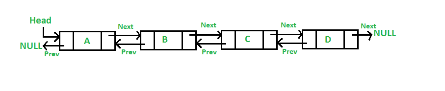

# Linked Lists

A Linked List is a data structure that is very similar to a dynamic array. An array is able to hold a specified amount of items. A dynamic array is open so that it may keep expanding. The difference between a dynamic array and a linked list is where the data is stored within memory. 

A dynamic array will have the data stored right next to each other. A linked list may have data stored in a random location. In order to access this data, a linked list will use **pointers**. We will discuss pointer more later in this lesson.

## Parts of a linked list

When visualizing a linked list, it can help to think of a snake. A snake has a head, a body, and a tail. Similarly, a linked list has a head and a tail. Unlike a snake, the "body" consists of nodes. Each node contains a value and a pointer to the next node in the list.

The head is where a linked list starts, it is also a node. As a linked list is like a dynamic array, you can have as many nodes as you need. The last node will not point to anything which makes it the tail. Visually, it might look like this:


There is one step further for a linked list and that is a double linked list. This type of list is mostly the same as a regular linked list, however there is a pointer to the previous node as well as the next node. A double linked list would look like this:



For this lesson, we will be working with a double linked list.

## Functions of a Linked List

A linked list has three main functions. Inserting, removing, and accessing. To better learn these functions, we will create a class in python which does each of these things. First we will create the class and then we will add the functions.

```Python
class LinkedList:
    def __init__(self):
       
        self.head = None
        self.tail = None
```

We will want to add a class for our node as well.

```Python
class Node:
    
        def __init__(self, data):
            
            self.data = data
            self.next = None
            self.prev = None
```

With our linked list and node class set up, we can now move onto the various functions of our linked list.

## Inserting

There are actually three difference scenarios related to inserting: inserting at the head, the tail, or the middle. We will go over each one in this section.

### Insert Head

We will start with the head as that is the first node we will need to make when creating our double linked list. We will make this function so that it can also insert a new node into the spot of head even after a head has been made.

1. To start, create a new node. `new_node = LinkedList.Node(value)`
2. Step two is to set the next of our new node to the current head. `new_node.next = self.head`
3. Next, we need to set prev of the current head to our new node. `self.head.prev = new_node`
4. Finally we can set the current head equal to the new node. `self.head = new_node`

With these steps our `insert_head` function is almost complete. We need to first tell it what to do if there is currently no head. Finally, our function might look like this.

```Python
def insert_head(self, value):

        new_node = LinkedList.Node(value)  
        
        if self.head is None:
            self.head = new_node
            self.tail = new_node

        else:
            new_node.next = self.head 
            self.head.prev = new_node 
            self.head = new_node      

```

### Insert Tail

The steps for inserting a tail is very similar to inserting our head. The only difference is that we switch step 2 and 3.

1. First, create a new node. `new_node = LinkedList.Node(value)`
2. Next, set the prev of our new node to the current tail. `new_node.prev = self.tail`
3. After that, we need to set the next of the current tail to our new node. `self.tail.next = new_node `
4. Finally we can set the current tail equal to the new node. `self.tail = new_node`

Just like the `insert_head` function, we also need to tell our `insert_tail` what to do if there is no current tail. The final function might look like this:

```Python
def insert_tail(self, value):
        
        new_node = LinkedList.Node(value)

        if self.tail is None:
            self.head = new_node
            self.tail = new_node
        
        else:
            new_node.prev = self.tail
            self.tail.next = new_node 
            self.tail = new_node
```

### Insert Middle

Inserting into the middle of a linked list is more complicated that inserting at the head or tail. To insert into the middle, we first need to know what node we want to insert before or after. For this example, we have already found that node and we want to insert it after. We will call this node `current`. This function has five steps.

1. Create a new node. `new_node = LinkedList.Node(value)`
2. Set the prev of our new node to the current node. `new_node.prev = current`
3. Set the next of our new node to the node after the current node. `new_node.next = current.next`
4. Set the prev of the next node after current to the new node `current.next.prev = new_node`
5. Finally, set the next of the current node to the new node `current.next = new_node`

The final function might look like this.

```Python
def insert_after(self, current, new_value):

    new_node = LinkedList.Node(new_value)
    
    new_node.prev = current       
    new_node.next = current.next

    current.next.prev = new_node  
    current.next = new_node
```

## Removing

Again, there are three difference scenarios related to removing: removing the head, the tail, or the middle. Removing is much simpler than inserting and each function only has two steps.

### Removing the head

1. Set the prev of the second node to nothing. `self.head.next.prev = None`
2. Set the head equal to the second node. `self.head = self.head.next`

To make sure there are no bugs, we also want to tell the function what to do if there is only one node. The function might look like this:

```Python
def remove_head(self):

        if self.head == self.tail:
            self.head = None
            self.tail = None
    
        elif self.head is not None:
            self.head.next.prev = None
            self.head = self.head.next
```

### Removing the tail

1. Set the next of the second to last node to nothing. `self.tail.prev.next = None`
2. Set the tail equal to the second node. `self.tail = self.tail.prev`

Again we want to check to see if there is only one node so our function might look like this:

```Python
def remove_tail(self):

        if self.head == self.tail:
            self.head = None
            self.tail = None

        elif self.tail is not None:
            self.tail.prev.next = None  
            self.tail = self.tail.prev
```

### Removing from the middle

Removing from the middle is much easier than inserting to the middle. Again, we have already found the node we want removed and will call it `current`.

1. Set the prev of the node after current to the node before current `current.next.prev = current.prev`
2. Set the next of the node before current to the node after current `current.prev.next = current.next`

By getting rid of the pointers, the data is removed from the linked list. We can save work in this function by calling our `remove_head` and `remove_tail` functions.

```Python
 def remove(self, current):   
    
    if current == self.head:
        self.remove_head()

    elif current == self.tail:
        self.remove_tail()
                
    else:
        current.next.prev = current.prev
        current.prev.next = current.next
```

## Accessing

The final function of a linked list is accessing data from a linked list. In order to access any information from the list, we will need to loop through the list. It is easiest to start at the head or tail and move forward or backward respectively. In the previous functions, we assumed that we knew which node we wanted to insert after or remove and called it `current`. The way we find current is through accessing. We will discuss starting at the head and starting at the tail.

### Going forward

To go forward we need to start at the head and then use a loop to go to the next node. In this function, we are going through and printing the value on each node.

```Python
def going_forward(self):

    current = self.head

    while current is not None:
        print(current.data)
        current = current.next
```

### Going backward

Starting at the tail and going backwards is almost the exact same as going forwards. The only different is we start at the tail and go to the previous node not the next. Again, we are only printing the data from each node in this example.

```Python
def going_backward(self):

    current = self.tail

    while current is not None:
        print(current.data)
        current = current.prev
```


## Why use a linked list?

While a linked list might seem more complicated than a dynamic array, it can be more efficient. Here is a table showing the difference in Big O notation for the various functions of both a linked list and dynamic array.

|   Operation   | Dynamic Array | Linked List
| ------------- | ------------- | -----------
| Insert Front  |     O(n)      |     O(1)
| Insert Middle |     O(n)      |     O(n)
| Insert End    |     O(1)      |     O(1)
| Remove Front  |     O(n)      |     O(1)
| Remove Middle |     O(n)      |     O(n)
| Remove End    |     O(1)      |     O(1)

From this table, we can see that a linked list is able to achieve O(1) performance while inserting in the front and end and while removing from the front and end. Inserting and removing from the middle requires one to parse through the whole list which gives it an O(n) performance. A dynamic array is able to to achieve O(1) only on inserting and removing at the end.
## Completed problem solved with a Linked List

In this problem, your company uses this linked list program to store their data. 

```Python
class LinkedList:
   
    class Node:
       

        def __init__(self, data):
           
            self.data = data
            self.next = None

    def __init__(self):
        
        self.head = None
        self.tail = None

    def insert_head(self, value):
       
        new_node = LinkedList.Node(value)  
        
        
        if self.head is None:
            self.head = new_node
            self.tail = new_node
       
        else:
            new_node.next = self.head 
            self.head = new_node     

    def insert_tail(self, value):
        
        new_node = LinkedList.Node(value)

        if self.tail is None:
            self.head = new_node
            self.tail = new_node
        
        else:

            self.tail.next = new_node 
            self.tail = new_node      

 
    
    def __iter__(self):
        
        curr = self.head  # Start at the begining since this is a forward iteration.
        while curr is not None:
            yield curr.data  # Provide (yield) each item to the user
            curr = curr.next # Go forward in the linked list
    
    def __str__(self):
        """
        Return a string representation of the linked list.
        """
        output = "linkedlist["
        first = True
        for value in self:
            if first:
                first = False
            else:
                output += ", "
            output += str(value)
        output += "]"
        return output
```

They want you to add a function to their program that will go through thier list and sort it so that the head is the largest number and the tail is the lowest. 

Solution:

```Python
def sort(self):
        if self.head == None:
            return
        else:
            curr = self.head
            while curr.next != None:
                index = curr.next
                while index != None:
                    if curr.data < index.data:
                        temp = curr.data
                        curr.data = index.data
                        index.data = temp
                    index = index.next
                curr = curr.next
```

## Tutorial problem for student to complete

The company you work for uses this program to store their data.

```Python
class LinkedList:
   
    class Node:
       

        def __init__(self, data):
           
            self.data = data
            self.next = None

    def __init__(self):
        
        self.head = None
        self.tail = None

    def insert_head(self, value):
       
        new_node = LinkedList.Node(value)  
        
        
        if self.head is None:
            self.head = new_node
            self.tail = new_node
       
        else:
            new_node.next = self.head 
            self.head = new_node     

    def insert_tail(self, value):
        
        new_node = LinkedList.Node(value)

        if self.tail is None:
            self.head = new_node
            self.tail = new_node
        
        else:

            self.tail.next = new_node 
            self.tail = new_node      

 
    
    def __iter__(self):
        
        curr = self.head  # Start at the begining since this is a forward iteration.
        while curr is not None:
            yield curr.data  # Provide (yield) each item to the user
            curr = curr.next # Go forward in the linked list
    
    def __str__(self):
        """
        Return a string representation of the linked list.
        """
        output = "linkedlist["
        first = True
        for value in self:
            if first:
                first = False
            else:
                output += ", "
            output += str(value)
        output += "]"
        return output
```
This program is able to create a linked list. They already have a large amount of data stored as a linked list in their system, however, they normally add the data to the end of the linked list. They do not need any duplicates in their data. Your company wants you to be able to take the linked list that is already in the system and delete any duplicates. 

You may need to write more than one function for this problem. You may not change any of the existing code, just add new functions to the class.

Some example code to test:
```Python
ll = LinkedList()
ll.insert_tail(1)
ll.insert_head(2)
ll.insert_head(2)
ll.insert_head(2)
ll.insert_head(3)
ll.insert_head(4)
ll.insert_head(5)
ll.insert_tail(3)
ll.insert_tail(0)
ll.insert_tail(-1)
print(ll) # linkedlist[5, 4, 3, 2, 2, 2, 1, 3, 0, -1]
ll.remove_duplicates()
print(ll) # linkedlist[5, 4, 3, 2, 1, 0, -1]
```

You can check your code with the solution here: [Solution](problem2.py)

[Back to Welcome Page](0-welcome.md)
