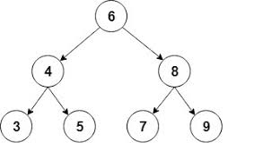
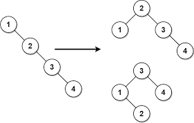

# Trees

A Tree data structure has many similarities to a linked list. Trees also have nodes that are connected to each other. The difference is that the nodes in a tree can connect to multiple different nodes. 

A binary tree is called such because each node can connect to two child nodes. It is easiest to visualize this by thinking of an upside down tree. The top node is called the root. The nodes at the bottom that do not have any child nodes are called leaf nodes. 



The next step of tree is called a binary search tree (BST). The only difference between a binary tree and a binary search tree is where on the tree the data is stored. A binary tree does not care what order the data is stored, as long as it is stored on the tree. A BST will look at the value of the node and assign it a place either lower, to the left, or higher, to the right, of the parent nodes. The picture above is a BST. These trees are sorted making it easier to access the data found within a tree. 

## Balance in BST

In order for a BST to perform at an O(log n), it needs to be balanced. A balanced binary search tree is unique in that any one side of the tree is not significantly larger than the other. To solve this issue, the tree needs to be reorganized. The picture below demonstrates what an unbalanced tree might look like (on the left) and how to organize it to make it balanced (either picture on the right).




## Functions of a tree

In order to write the functions of a tree, we first need to discuss recursion. Recursion is where we call the current function inside of the function. An important thing to remember when writing recursions is to have a base case. A base case is the what we tell the program is the stopping point. It is a case when recursion is no longer required. Without a base case, the program could run forever. An example of a recursion with a base case is this:

```Python
def hello_world(count):
    if count <= 0: # Base Case
        return
    else:
        print("Hello World")
        hello_world(count - 1) #Recursion
```

Another useful addition to recursion is memoization. Memoization involves creating a dictionionary within the function to remember previous results. This is useful when the recursion needs to remember information from each execute. We also want to make sure that the dictionary is only created the first time we call the function. The code might look like this:

```Python
if remember is None:
    remember = dict()
```
```Python
if n in remember:
    return remember[n]
```
```Python
remember[n] = result
```

Now that we know some recursion, the functions of trees will be easier. With these two main functions, you will be able to create any other needed functions.

## Inserting

The first function we will discuss is inserting into a BST. This function uses recursion to decide where to put the node. As discussed earlier, we want the value to go to the right if it is higher or the left if it is lower. We continue moving down the tree until we reach a free node. The code for inserting looks like this:

```Python
def insert(self, data):
        if self.root is None:
            self.root = BST.Node(data)
        else:
            self._insert(data, self.root)  

def _insert(self, data, node):
    if data < node.data:
        if node.left is None:
            node.left = BST.Node(data)
        else:
            self._insert(data, node.left)
    elif data > node.data:

        if node.right is None:
            node.right = BST.Node(data)
        else:
            self._insert(data, node.right)
    else:
        return
```

## Traversing

The next function we will discuss is traversing. Traversing a BST is used to display all the data or when trying to find a data in the tree. Before we dive into the code, we also need to know `yield`. `yield` allows us to only do something once per recursion. After it finishes, it moves onto the next yield. This prevents it from doubling up.  Recursion is used heavily in this step. The code for traversing looks like this:

```Python
def __iter__(self):
	
	yield from self._traverse_forward(self.root)

def _traverse_forward(self, node):
	if node is not None:
		yield from self._traverse_forward(node.left)
		yield node.data
		yield from self._traverse_forward(node.right)
```

## Why use a tree?

While a linked list can be used to store most any kind of data, a tree is best used with numerical values. A tree data structure performes slightly worse to a linked list with its main functions resulting in a O(log n) rather than an O(1). However, binary search trees have many advantages. First, a BST is automatically sorted when inserting new data. This makes it much easier to find the data we have stored. The binary element of a BST means that we can also use binary when searching through the tree. If we want to see if a value is in the tree, we just have to check if the value is higher or lower than the current node and move accordingly.

## Completed problem solved with a Tree

Your company uses a Binary Search Tree to store its data. Although they are able to store their data, they do not have a program to delete their data. Write a program that can look through the data of a BST and then delete a node if that data is found.

This is the format for the Nodes.

```Python
class BSTNode:
    def __init__(self, data):
        self.data = data
        self.left = None
        self.right = None
```

You can also use this code to test your solution.

```Python
def traverse(node): 
    if node is None: 
        return      
    print(node.data)
    traverse(node.left) 
    traverse(node.right)   

root = BSTNode(5)
root.left = BSTNode(3)
root.right = BSTNode(7)
root.left.left = BSTNode(2)
root.left.right = BSTNode(4)
root.right.left = BSTNode(6)
root.right.right = BSTNode(8)
print("Original node:")
print(traverse(root))
result = delete(root, 3)
print("After deleting specified node:")
print(traverse(result))
```

### Solution
```Python
def delete(root, data):

    if root is None:
        return
    
    if root.data == data:

        # If node has no children
        if root.left is None and root.right is None:
            return
        
        # If node has right child
        if root.left is None and root.right is not None:
            return root.right
        
        # If node has left child
        if root.right is None and root.left is not None:
            return root.left
        # If node has both child
        point = root.right
        while point.left:
            point = point.left
        root.data = point.data
        root.right = delete(root.right, root.data)

    # If node is greater than data, go left
    elif root.data > data:
        root.left = delete(root.left, data)
    
    # If node is less than data, go right
    else:
        root.right = delete(root.right, data)

    return root
```
## Tutorial problem for student to complete

For this problem, your company uses binary search trees to store their values. They normally just add everything to the tree without caring about overall height. They want you to write a program that balances the binary tree so that there is not one side much higher than the other.

This is the format for the Nodes.

```Python
class BSTNode:
    def __init__(self, data):
        self.data = data
        self.left = None
        self.right = None
```

You can also use this code to test your solution.

```Python
def traverse(node): 
    if node is None: 
        return      
    print(node.data)
    traverse(node.left) 
    traverse(node.right)   

root = BSTNode(5)
root.left = BSTNode(3)
root.right = BSTNode(7)
root.right.left = BSTNode(6)
root.right.right = BSTNode(8)
root.right.right.right = BSTNode(9)
root.right.right.right.right = BSTNode(10)
print("Original node:")
print(traverse(root)) # 5, 3, 7, 6, 8, 9, 10

root = balanceBST(root)
print("After Balancing")
print(traverse(root)) # 7, 5, 3, 6, 9, 8, 10
```

You can check your code with the solution here: [Solution](problem3.py)

[Back to Welcome Page](0-welcome.md)
